# Comparing Machine Learning Algorithm Performance using Machine Learning Operations (MLOps) and the AWS Cloud Development Kit (CDK)

This is a project built using AWS Cloud Development Kit (AWS CDK). It shows how to fully automate the complete life cycle of how to perform comparison between two machine learning algorithms. For this project we are going to solve a regression use case to determine the age of the Abalone using both "XGboost" and "Linear learner" Algorithms. The main goal here is to show the process and how to automate data transformation, training, creation of models and endpoint configurations and finally how to automate performing the prediction against the deployed endpoints to determine which model is having a better prediction results. This will happen in a complete serverless environment using below aws services:

- Amazon Simple Storage Service (Amazon S3)
- AWS Lambda
- AWS Step functions
- Amazon Sagemaker

## Table of contents:
- [Setup](#Setup)
- [Fetching and exploring the dataset](#Fetching-and-exploring-the-dataset)
- [Starting the execution](#Starting-the-execution)
- [Architectural Overview](#Architectural-Overview)
- [Results](#Results)
- [What is next?](#What-is-next)
- [Cleanup](#Cleanup)


---
## Setup

In order to have the environment setup in your AWS account, you need first to fulfil all prerequisites required for cdk installtion following this [link](https://docs.aws.amazon.com/cdk/latest/guide/getting_started.html#getting_started_prerequisites).

You can confirm that the cdk is working fine using the below command

```
cdk --version
```

Then clone this repo and deploy it's infrastructure to your account using below commands.

```
## If you use https clone run below command
git clone https://github.com/aws-samples/aws-comparing-algorithms-performance-mlops-cdk.git

## If you use ssh then run below
git clone git@github.com:aws-samples/aws-comparing-algorithms-performance-mlops-cdk.git

## installation and deploy
cd aws-comparing-algorithms-performance-mlops-cdk/
npm install
cdk bootstrap
cdk deploy
```
<br/><br/>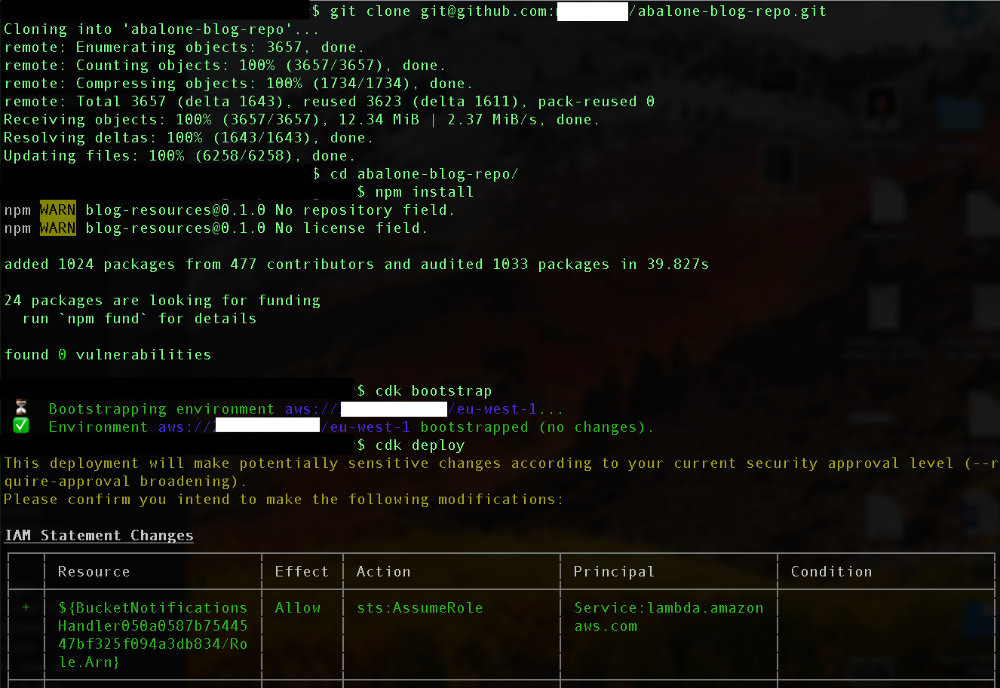<br/><br/>

After the solutions has been deployed to your account successfully, this can be confirmed from the output of the cdk deploy command returning the CloudFormation stack arn as below.

<br/><br/>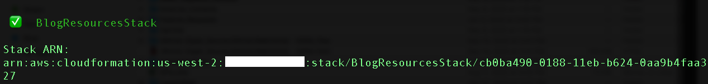<br/><br/>

---
## Fetching and exploring the dataset

We use the [Abalone data](https://www.csie.ntu.edu.tw/~cjlin/libsvmtools/datasets/regression.html) originally from the [UCI data repository](https://archive.ics.uci.edu/ml/datasets/abalone).

The dataset contains 9 fields ('Rings','Sex','Length','Diameter','Height','Whole Weight','Shucked Weight','Viscera Weight' and 'Shell Weight') starting with the Rings number which is a number indicating the age of the abalone (as age equals to number of rings plus 1.5). Usually the number of rings are counted through microscopes to estimate the abalone's age. So we will use our algorithms to predict the abalone age based on the other features which are mentioned respectively as below within the dataset. A snippet dataframe is explained below showing each feature of the abalone dataset and it's corresponding datatype.<br/><br/>

```
** data frame snippet**:
age               int  11 8 15 7 7 8 20 14 9
Sex               <feature_number>: factor with 3 levels "F","I","M" values of 1,2,3
Length            <feature_number>: float  0.255 0.145 0.53 0.42 0.32 0.423 ...
Diameter          <feature_number>: float  0.363 0.164 0.42 0.355 0.151 0.32 ...
Height            <feature_number>: float  0.019 0.05 0.235 0.225 0.16 0.0755 ...
Whole.weight      <feature_number>: float  0.312 0.213 0.532 0.412 0.601 ...
Shucked.weight    <feature_number>: float  0.4535 0.0564 0.2363 0.1153 0.0823 ...
Viscera.weight    <feature_number>: float  0.111 0.0222 0.4123 0.2133 0.0345 ...
Shell.weight      <feature_number>: float  0.31 0.08 0.21 0.155 0.044 0.11 ...
```

The above features starting from sex to Shell.weight are physical measurements that can be measured using the correct tools, so we improve the complixety of having to examine the abalone under microscopes to understand it's age.<br/><br/>

In order to download the dataset we need to run the below python script which can be found in the "scripts" folder named "download_and_divide.py" which will download the original dataset and divide it into two datasets named "dataset1.csv" and "dataset2.csv". We will be using those two datasets to show how the solution can continously include more data and use the added data for the training of the models.<br/><br/>

```
python scripts/download_and_divide.py
```
<br/><br/><br/><br/>

---
## Starting the execution

1. Now that we have the infrastructure setup and datsets ready, let's start the execution and explore what the solution is performing.

We start by uploading the the first half of the data set named "dataset1.csv" to the bucket named "abalone-blog-< ACCOUNT_ID >-< REGION >" to <span style="color:red">*/Inputs*</span> folder.

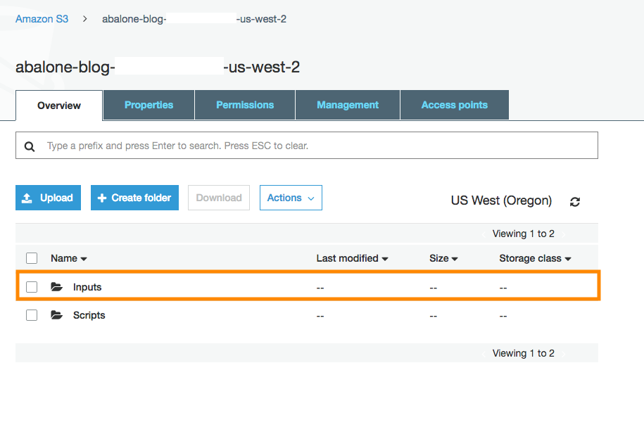<br/><br/>

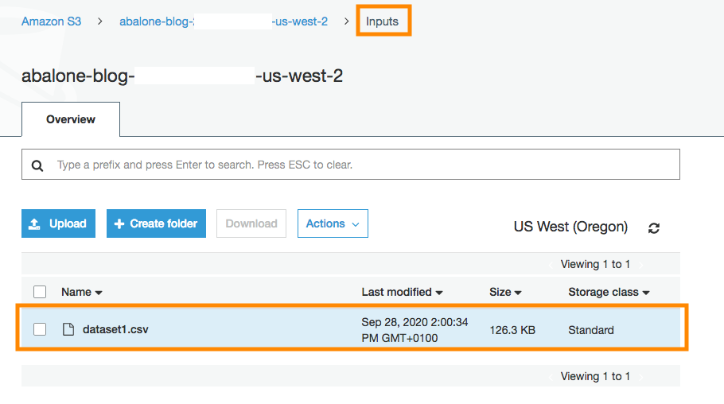<br/><br/>

---
## Architectural Overview

This architecture serves as an example of how you can build a MLOps pipeline that orchisterates the comparison of results between two algorithms predictions.<br/>

The solution uses a completely serverless environment so you don’t have to worry about managing the infrastructure. It also makes sure that the deployed endpoints which will be used for predictions are deleted immediately after collecting the predictions results not to incur any additional costs.<br/><br/>


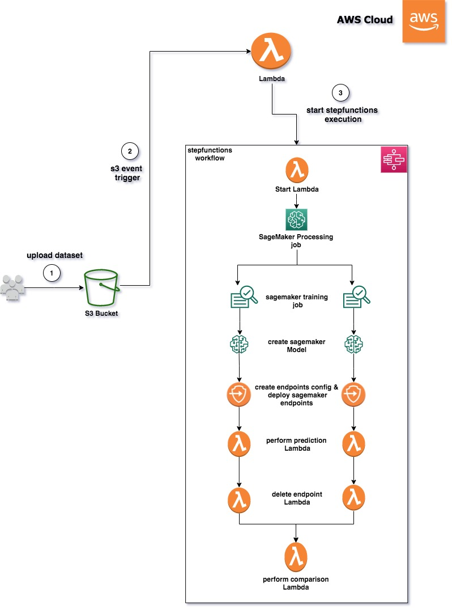<br/><br/>

2. Once the dataset is uploaded to the Inputs folder using [s3 event notification](https://docs.aws.amazon.com/lambda/latest/dg/with-s3.html) it initiate the MLOps pipeline built using a Step Functions state machine.<br/><br/>


3. The starting lambda will start by collecting the region corresponding [training images URIs](https://docs.aws.amazon.com/sagemaker/latest/dg/sagemaker-algo-docker-registry-paths.html) for both Linear Learner and XGBoost algorithms which will be used in training both algorithms over the dataset. It will also get the [Amazon SageMaker Spark Container Image](https://github.com/aws/sagemaker-spark-container/blob/master/available_images.md) which will be used for running the SageMaker processing Job.<br/><br/>

4. The dataset is in libsvm format which is accepted by the XGBoost algorithm as per the [Input/Output Interface for the XGBoost Algorithm](https://docs.aws.amazon.com/sagemaker/latest/dg/xgboost.html#InputOutput-XGBoost). However, this is not supported by the Linear Learner Algorithm as per [Input/Output interface for the linear learner algorithm](https://docs.aws.amazon.com/sagemaker/latest/dg/linear-learner.html#ll-input_output). So we need to run a processing job using [Amazon SageMaker Data Processing with Apache Spark](https://docs.aws.amazon.com/sagemaker/latest/dg/use-spark-processing-container.html). The processing job will transform the data from libsvm to csv and will divide the dataset into train, validation and test datasets. The output of the processing job will be stored under <span style="color:red">*/Xgboost*</span> and <span style="color:red">*/Linear*</span> directories (prefixes).<br/><br/>

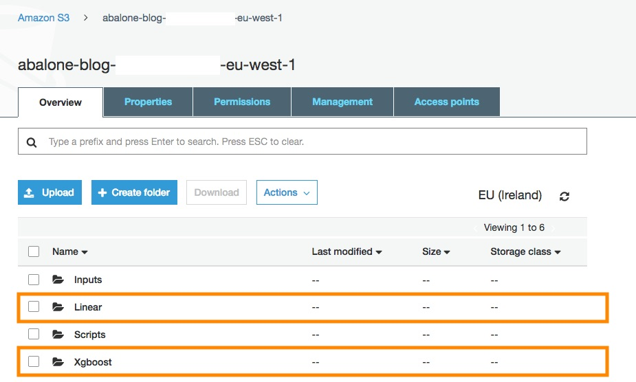<br/><br/>

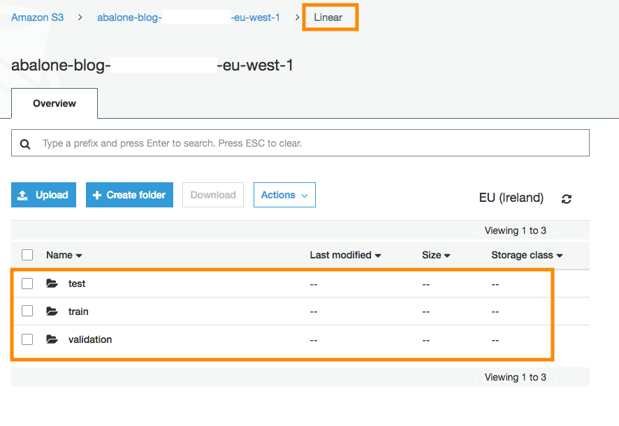<br/><br/>

5. The workflow of Step Functions will perform the following steps in parallel
    > a.Train both algorithms.<br/>
    > b.Create models out of trained algorithms.<br/>
    > c.	Create endpoints configurations and deploy predictions endpoints for both models.<br/>
    > d.	Invoke lambda function to perform 3 live predictions using boto3 and the “test” sample taken from the dataset to calculate the average accuracy of each model.<br/>
    > e.	Invoke lambda function to delete deployed endpoints not to incur any additional charges.<br/>
    > f.	Invoke Lambda function to determine which model is having better accuracy in predicting the values.<br/>
<br/><br/>

The overall flow of step functions execution can be viewed by refering to the to the step functions defintion graph below.<br/>
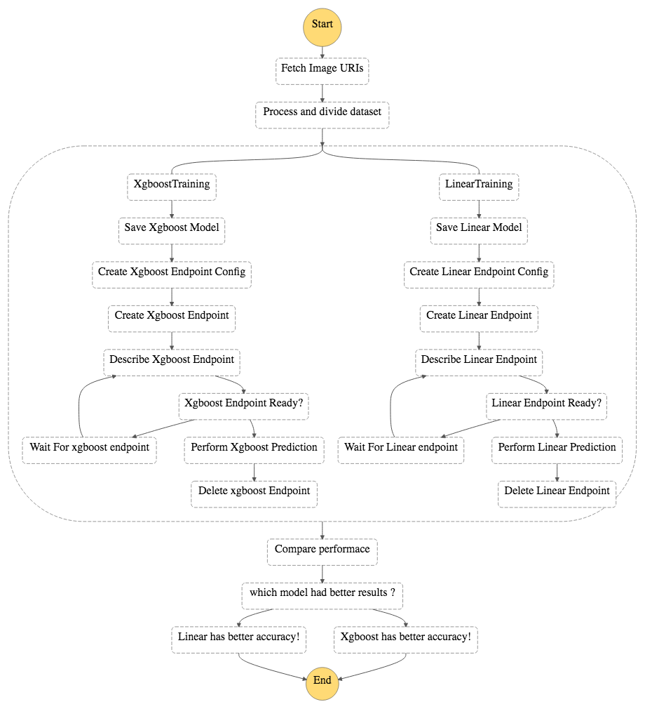<br/><br/>

P.S: Note that training, deployment of endpoints and performing live predictions. These steps are executed in parallel. Also once the prediction is performed, all deployed endpoints will be automatically deleted in order not to incur any additional charges.<br/><br/>

6. You can now watch the step functions workflow progress by going to Step Functions [console](https://console.aws.amazon.com/states/home) and locate the state machine named  abaloneStepFunction<span style="color:red">*random-string*</span><br/><br/>

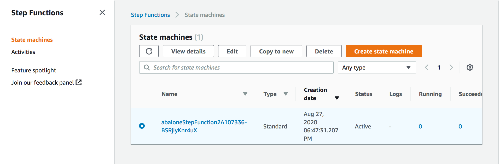<br/><br/>

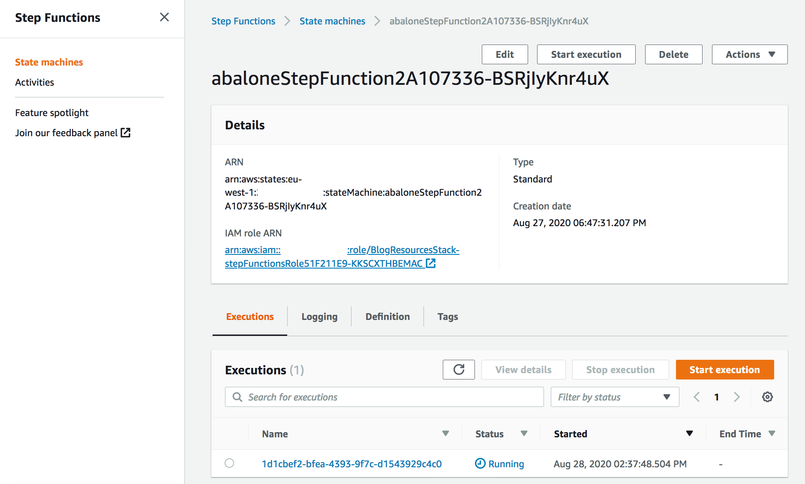<br/><br/>

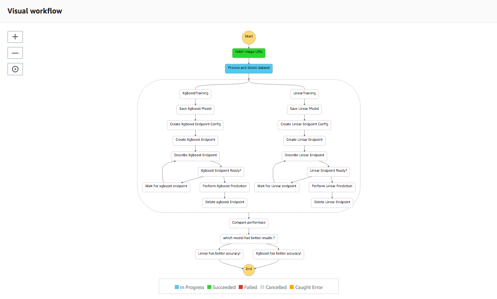<br/><br/>

---
## Results

After waiting for the complete execution of step functions work flow, we can see the results as below, this doesn't mean that this algorithm is better than the other in <strong>all circumstances.</strong> It just means that based on the hyperparameters configured for each algorithm and number of epochs performed, they resulted in that performance. 

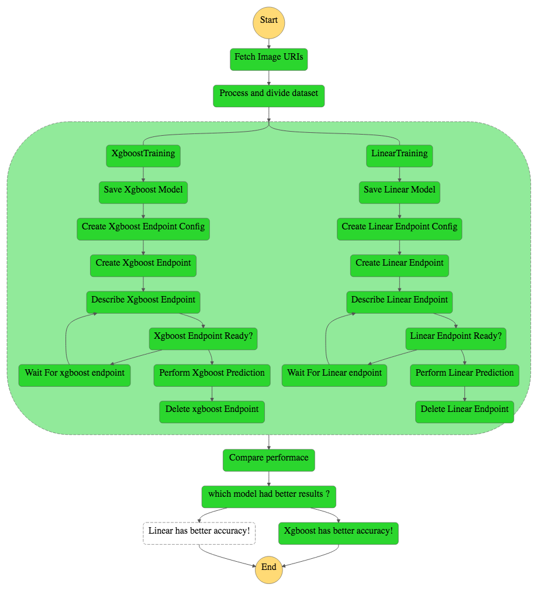<br/><br/>

To make sure that you are using the best version of the models, you would need to run a [hyperparameters tuning jobs](https://docs.aws.amazon.com/sagemaker/latest/dg/sagemaker-mkt-algo-tune.html) which will run many training jobs on your dataset using the algorithms and ranges of hyperparameters that you specify. This will help you allocate which set of hyperparameters is giving the best results<br/><br/>

---
## What is next?

Now, you can use the other half of the dataset named "dataset2.csv" to upload to the s3 "Inputs" folder. This will add more data and increase the amount of data used to train the models which shows how this process can be repeatitive based on the frequency of collected data that will be used to train the models.

<br/><br/>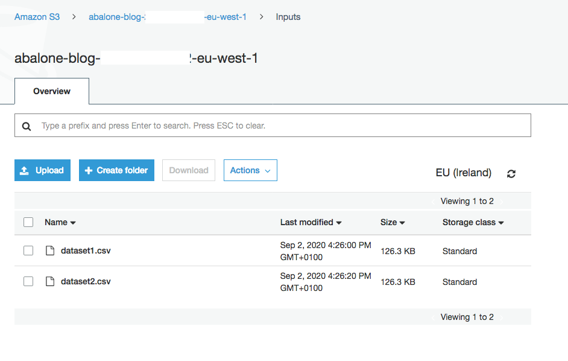<br/><br/>

Finally, you can use this comparison to determine which algorithm is best suited for your production environment. Then you can configure your step functions workflow to update the configuration of the production endpoint with the better performing algorithm.

<br/><br/>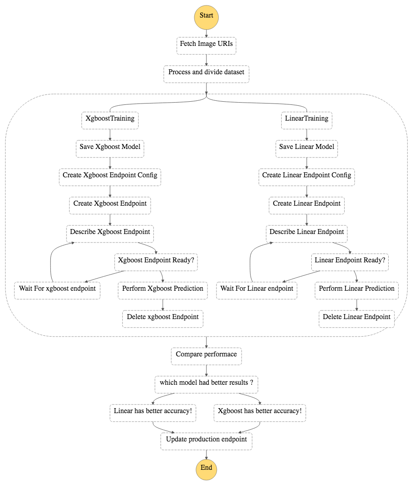<br/><br/>

---
## Cleanup

In order to delete all the infrastructure created, you can perform the below command which will delete the cloudformation stack used to provision the resources.

```
cdk destroy
```
<br/><br/>

---
## Security

See [CONTRIBUTING](CONTRIBUTING.md#security-issue-notifications) for more information.

## License

This project is licensed under the Apache-2.0 License.
